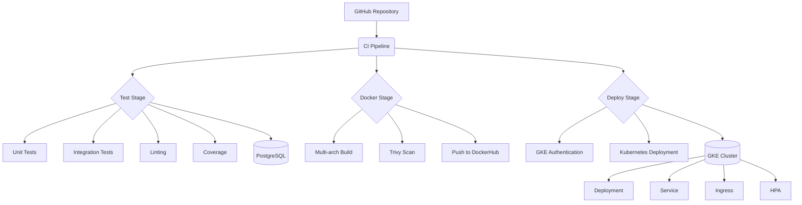

# DevOps Prueba Técnica – Demo DevOps Python

## Descripción

Este proyecto es una solución integral para la prueba técnica DevOps. Consiste en una aplicación Python (Django REST) dockerizada, con pipeline CI/CD, análisis de código, despliegue automatizado en Kubernetes y documentación completa.

---

## Tabla de Contenidos

- [Arquitectura y Diagrama](#arquitectura-y-diagrama)
- [Requerimientos y Solución](#requerimientos-y-solución)
- [Ejecución Local](#ejecución-local)
- [Dockerización](#dockerización)
- [Pipeline CI/CD](#pipeline-cicd)
- [Despliegue en Kubernetes](#despliegue-en-kubernetes)
- [Recursos Kubernetes](#recursos-kubernetes)
- [Variables de Entorno](#variables-de-entorno)
- [Pruebas y Cobertura](#pruebas-y-cobertura)
- [Acceso Público y Resultados](#acceso-público-y-resultados)
- [Justificación de Requerimientos](#justificación-de-requerimientos)
- [Referencias](#referencias)

---

## Arquitectura y Diagrama


---

## Requerimientos y Solución

- **Dockerización:**  
  - Usuario no root, variables de entorno, healthcheck, puerto configurable.
- **Pipeline CI/CD:**  
  - Build, test, lint, cobertura, build/push Docker, escaneo de vulnerabilidades, despliegue automático en Kubernetes.
- **Kubernetes:**  
  - 2+ réplicas, HPA, ConfigMap, Secret, Ingress, Service, Namespace.
- **Documentación:**  
  - Este README, diagramas, instrucciones, justificación de decisiones.

---

## Ejecución Local

1. **Clonar el repositorio:**
    ```bash
    git clone https://github.com/Freperush/freperush-devsu-devops-test.git
    cd demo-devops-python
    ```

2. **Variables de entorno:**  
   Edita `.env` según tus necesidades.

3. **Levantar con Docker Compose:**
    ```bash
    docker-compose up --build
    ```

4. **Acceso:**  
   - API: [http://localhost:8765/api/](http://localhost:8765/api/)

---

## Dockerización

- Archivo [`dockerfile`](dockerfile)
- Usuario seguro (`appuser`)
- Variables de entorno vía `.env`
- Healthcheck HTTP
- Exposición de puerto configurable
- docker push freperush/demo-devops-python:lastest

---

## Pipeline CI/CD

- Archivo: [`.github/workflows/ci.yml`](.github/workflows/ci.yml)
- **Etapas:**
  - Checkout, build, test, lint (flake8), cobertura (coverage), build/push Docker, escaneo (Trivy), despliegue en Kubernetes.
- **Resultados:**  

  - [Enlace a ejecución exitosa del pipeline](https://github.com/Freperush/freperush-devsu-devops-test/actions/runs/16066805790)  

  Arquitectura CI/CD para Django con Kubernetes

## 🚀 Pipeline CI/CD

### 📌 Configuración
- **Archivo:** [`.github/workflows/ci.yml`](.github/workflows/ci.yml)
- **Última ejecución exitosa:** [Ver detalles](https://github.com/Freperush/freperush-devsu-devops-test/actions/runs/16066805790)

### 🔄 Flujo del Pipeline

---

## Despliegue en Kubernetes

- Compatible con Minikube, Docker Desktop o GKE.
- Manifiestos en [`k8s/`](k8s/)
- Recursos:
  - Namespace, Deployment (2+ réplicas), Service, Ingress, ConfigMap, Secret, HPA.
- Despliegue automático desde el pipeline.

### Despliegue manual local (Minikube):

```bash
kubectl apply -f k8s/Local/namespace.yaml
kubectl apply -f k8s/Local/configmap.yaml -n namespace-devops-python
kubectl apply -f k8s/Local/secret.yaml -n namespace-devops-python
kubectl apply -f k8s/Local/deployment.yaml -n namespace-devops-python
kubectl apply -f k8s/Local/service.yaml -n namespace-devops-python
kubectl apply -f k8s/Local/hpa.yaml -n namespace-devops-python
kubectl apply -f k8s/Local/ingress.local.yaml -n namespace-devops-python
```

---

## Recursos Kubernetes

- [`k8s/Local/namespace.yaml`](k8s/Local/namespace.yaml)
- [`k8s/Local/deployment.yaml`](k8s/Local/deployment.yaml)
- [`k8s/Local/service.yaml`](k8s/Local/service.yaml)
- [`k8s/Local/ingress.local.yaml`](k8s/Local/ingress.local.yaml)
- [`k8s/Local/configmap.yaml`](k8s/Local/configmap.yaml)
- [`k8s/Local/secret.yaml`](k8s/Local/secret.yaml)
- [`k8s/Local/hpa.yaml`](k8s/Local/hpa.yaml)

---

## Variables de Entorno

Se gestionan vía `.env`, ConfigMap y Secret.  
Ejemplo:

```env
DJANGO_PORT=8765
DJANGO_SECRET_KEY=...
DATABASE_NAME=db.sqlite3
PYTHONUNBUFFERED=1
```

---

## Pruebas y Cobertura

- Pruebas unitarias con Django Test y DRF.
- Cobertura con `coverage`.
- Lint con `flake8`.
- Ejecución en pipeline y local:
    ```bash
    python manage.py test
    ```

---

## Acceso Público y Resultados

- **Repositorio GitHub:**  
  [https://github.com/Freperush/freperush-devsu-devops-test](https://github.com/Freperush/freperush-devsu-devops-test)
- **Pipeline:**  
  [GitHub Actions](https://github.com/Freperush/freperush-devsu-devops-test/actions)
- **Endpoint público:**  
    Para acceder correctamente al endpoint `http://demo-devops-python.local/api/users/`, es necesario agregar una entrada al archivo `/etc/hosts` de tu sistema.
    ### Paso 1: Editar el archivo /etc/hosts
    Agrega la siguiente línea al final del archivo:
    34.107.142.136       demo-devops-python.local
    > Nota: Este archivo requiere permisos de administrador. Puedes editarlo con:
    > sudo nano /etc/hosts
    ### Paso 2: Probar el acceso
    Luego de guardar los cambios, puedes acceder desde el navegador o usar curl:
    http://demo-devops-python.local/api/users/
---


---

## Referencias

- [Documentación Django](https://docs.djangoproject.com/)
- [Documentación Kubernetes](https://kubernetes.io/docs/)
- [GitHub Actions](https://docs.github.com/en/actions)
- [Docker](https://docs.docker.com/)


---

**¡Gracias por revisar este ejercicio!**
